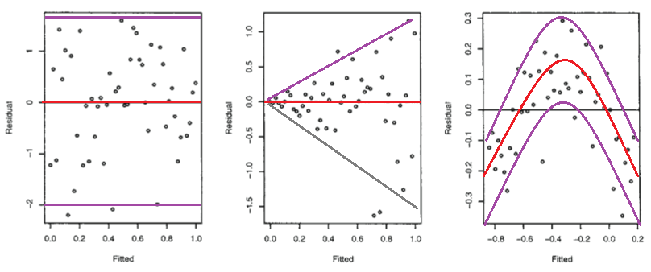

### Constant variability

The residuals of a linear model are arranged above and below the line. As we saw in the previous section, this arrangement should look similar to a normal distribution, i.e.

* most residuals will be small (close to the line)
* a few residuals will be large

The linear model also assumes that this normal distribution is the same in all parts of the model (i.e. at both high and low value of $x$).

For example, in this model, we can clearly see that the variation in the residuals *is not constant* - this is a violation of this third assumption of the linear model:

```{r}
set.seed(46)
x <- 1:100 + rnorm(100)
y <- x + 100:1 * rnorm(100)
ggplot(mapping = aes(x, y)) +
  geom_point() +
  geom_smooth(method = "lm", se = FALSE) +
  labs(title = "Decreasing variation in points")
```

In the graph above, the points on the right lie much closer to the line: i.e. the residuals will be smaller.

For simple linear models like this (with only a single explanatory variable $x$), we can get a reasonable idea of the variability of the residuals just by looking at a scatter plot of the model, as above.

For comparison, here is the model you fit earlier:

```{r}
sim_df %>%
  ggplot(mapping = aes(x, y)) +
  geom_point() +
  geom_smooth(method = "lm", se = FALSE)
```


```{r assumption_3_quiz, eval=is_tutorial}
question(
  "Does your model (as shown above) satisfy the linear model's assumption of constant variability of residuals?",
  answer("Yes, the model satisfies this assumption.", correct = TRUE),
  answer("No, the model violates this condition."),
  allow_retry = TRUE
)
```

But as with the previous assumption of linearity we can't plot the original model in a two dimensional screen or page if we have more than one explanatory variable.

Fortunately there is another that we can make for any type of model! This is a *residuals vs predicted plot*, which has the residuals (on the y-axis) vs the predicted response variable (x-axis). This graph will also always have just two dimensions, regardless of how many explanatory variables are in our model, and so it is ideal for assessing this assumption.

In this graph, our reference line should be a horizontal line plotted at $y = 0$, because the residuals should be distributed around zero in all parts of the model.

Here are three example residual vs predicted plots (with purple guide lines showing the variability):

* The left-most plot shows constant variability of the residuals above and below the line.
* The middle graph violates this assumption because the variability of the residuals increases as the predicted values increase.
* The third graph also violates this assumption, because the variation above and below the line is not consistent (this pattern arises because there is not a linear relationship between the response and explanatory variables - the residual vs predicted plot can also be used to examine the first assumption of linearity).

<!-- TODO: create my own version of this -->

```{r, out.width = "600px"}

```

<!-- TODO:
- use geom_smooth() to create a trend line?
- is there a function that will plot the approximate upper and lower boundaries of this data?

- also show examples of meeting vs violating the assumption.

- mention "heteroskedasticity"

- mention that the linear model is reasonably robust to violations of this assumption

- have questions asking students to interpret different assumptions plots
-->

<!-- Book version -->

<!-- TODO: Add exercises -->

<!-- End book -->

<!-- Tutorial version -->

```{r, eval=is_tutorial, echo=FALSE, results = 'asis', eval=is_tutorial}
cat('<p class="comment3">
Fill in the *3* blanks to create a residuals vs. predicted plot (remember that these are stored in the `.resid` and `.fitted` columns that we created with the `augment()` function). Set the `geom_hline()` to intercept at $y = 0$.
</p>')
```

```{r add_pred_and_resid, eval=is_tutorial, echo=FALSE}
diamonds_model <- lm(price ~ carat + depth, data = diamonds)
diamonds_plus_preds <- augment(diamonds_model, diamonds)
```

```{r zjheaqgdmjiltikc, exercise = TRUE, exercise.setup = "add_pred_and_resid", eval=is_tutorial}
diamonds_plus_preds %>%
  ggplot() +
  geom_point(mapping = aes(x = ______, y = ______)) +
  geom_hline(yintercept = ____, color = "white", size = 2)
```

```{r zjheaqgdmjiltikc-solution, eval=is_tutorial}
diamonds_plus_preds %>%
  ggplot() +
  geom_point(mapping = aes(x = .fitted, y = .resid)) +
  geom_hline(yintercept = 0, color = "white", size = 2)
```

```{r zjheaqgdmjiltikc-check, eval=is_tutorial}
# check code
gradethis::grade_code()
```


```{r, eval=is_tutorial, echo=FALSE, results = 'asis', eval=is_tutorial}
cat('We can clearly see that the variability of residuals is not constant above and below the reference line.')
```

<!-- End tutorial -->
