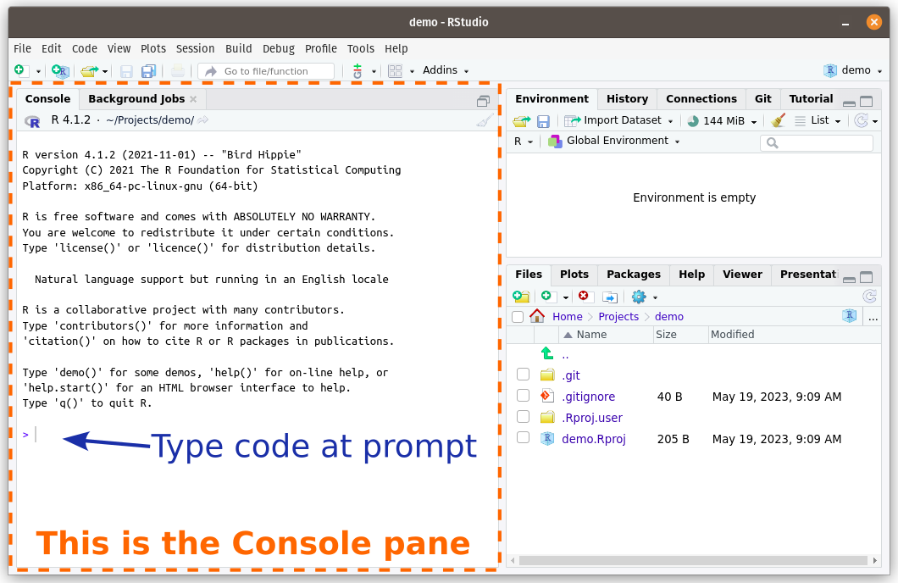
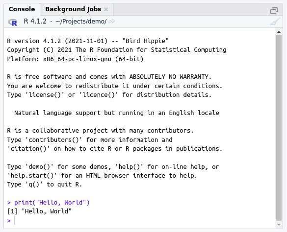

It is a long-standing tradition that your first program in any new programming language should simply display the message "Hello, World!".

```{r, echo=FALSE, results='asis'}
pdf_dev_comment("TODO: video: 'first R program' which is hello world overview")
```

In R we can use the `print()` *function* to display a piece of data (such as the text *Hello, World!*).

For example, we can run this line of code in R:

```r
print("Hello, World!")
```

And R will return this result:

```{r, echo=FALSE}
print("Hello, World!")
```

::: {.info-box .callout-tip}
**What's happening here?**

We will learn more about the different parts of this code in this chapter, but briefly:

* `print(...)` is a **function**: it is a recipe that takes some input ingredients (which we list between the parentheses after the function's name), and does something with them.
* `"Hello, World!"` is a *string* of characters (and other symbols, such as `!`). A **character string** is a type of data that computers can work with. Here we are supplying it as the input argument to the `print()` recipe.

When you hit *Enter*, R figures out how to covert this code into a series of electrical currents that your computer's processor can understand. The result comes back as another series of electrical currents, which R then figures out how to convert back into something that a human can understand.
:::

```{r, echo=FALSE, results='asis'}
pdf_dev_comment("TODO: convert following exercises to render functions")
```

<!-- Book code -->

```{r hello-world-exercise-book, echo=F, eval=is_book, results = 'asis'}
cat("::: {.exercise .callout-note appearance='simple' icon=false}

**Exercise: Try it yourself:** Open up RStudio and copy or type the line of code into the RStudio Console pane (see Fig. @fig-rstudio-overview-console).

{#fig-rstudio-overview-console}

Note that you will need to write the code after the *prompt*, which is the `>` symbol that starts the lowest line in the Console.

After you have written all the code, press the <Enter> key on your keyboard. This will send your code to the R Console, which will run it and return the output. You should get back the same output as we saw earlier (Fig. @fig-rstudio-helloworld).

{#fig-rstudio-helloworld}

Congratulations! You just ran your first program in R.

:::")
```

<!-- End book -->

<!-- Tutorial code -->

```{r hello-world-exercise-instructions-tutorial, echo=F, eval=is_tutorial, results = 'asis'}
cat('<p class="comment3">
<b>Exercise:</b> Run the simple program in the code section below (click on *Run Code*). The output of the program will be displayed below the code section. Then edit the text inside the `print()` function to the correct text (*Hello, World!*), and try running the code again. Once it displays the correct statement, click the *Submit Answer* button.
<br><br>
(If a yellow box appears warning you that your answer is "invisible", don\'t worry. You can safely ignore this.)
</p>')
```

```{r hello-world-exercise-tutorial, eval=is_tutorial, exercise=TRUE, echo=F}
print("Hello, Student!")
```

```{r hello-world-exercise-tutorial-hint, echo=F, eval=is_tutorial, results = 'asis'}
cat('<div id="hello-world-hint-1">
<p class="comment">
**Hint:** Enter the correct text inside quotation marks.
</p>
</div>
<div id="hello-world-hint-2">
<p class="comment">
**Hint:** Make sure all the words are spelled and capitalized correctly, and the punctuation is correct.
</p>
</div>')
```

```{r hello-world-exercise-tutorial-solution, eval=is_tutorial, echo=F}
print("Hello, World!")
```

```{r hello-world-exercise-tutorial-check, eval=is_tutorial, echo=F}
gradethis::grade_code("You just ran your first program! Don't worry, things will get more interesting soon...")
```

<!-- End tutorial -->

```{r, echo=FALSE, results='asis'}
pdf_dev_comment("TODO: **Programming vs. cooking** callout block")
```
<!-- 

<!-- Book code -->

```{r rerun-console-exercise-book, echo=F, eval=is_book, results = 'asis'}
cat(':::: {.exercise .callout-note appearance="simple" icon=false}

**Exercise:** Try to edit the line in the Console containing the `print("Hello, World!")` command that you just ran. Can you change it to print out something else?

:::{.callout-tip}
Once you have pressed <Enter> to run a line of code in the Console, you cannot go back and change it. To modify it, you will need to re-type out the code at the empty prompt at the bottom of the Console (below the output of the last line of code that you ran). You cannot edit a line of code in the Console that has already been run.
:::

It can get tedious to rewrite the code you have already run in the Console. However, click at the new (empty) Console prompt, and press the Up arrow on your keyboard. RStudio should autofill the prompt with the previous line of code from your history.

Modify this line to print out a different sentence, and rerun your new code.
::::')
```

<!-- End book -->
